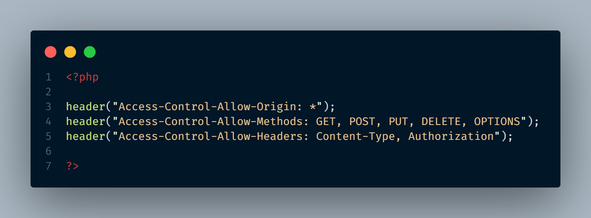

# Projet PHP API REST avec AltoRouter

## Description
Ce projet est une API REST simple développée en PHP, utilisant AltoRouter pour gérer les requêtes et les réponses JSON pour les opérations CRUD.

## Points clés
- **API REST** : Suit les principes REST pour permettre la gestion des ressources via des méthodes HTTP (GET, POST, PUT, DELETE).
- **MVC (Modèle-Vue-Controller)** : Structure qui sépare la logique métier et les contrôleurs API, permettant une meilleure organisation du code.
- **Design Patterns** :
  - **Singleton** : Assure qu'une classe ait une seule instance pour gérer la connexion à la base de données.
  - **Factory** : Définit une interface pour créer des objets sans spécifier leurs classes concrètes.
  - **Injection de dépendances** : Facilite la gestion des dépendances pour améliorer la testabilité.

## Structure du projet
- **config/** : Contient les fichiers de configuration.
  - **Router.php** : Définit les routes de l'API avec AltoRouter.
  - **Constante.php** : Contient les informations de connexion à la base de données.
  - **header.php** : Fichier de configuration pour les en-têtes des requêtes API (à modifier selon vos besoins).

- **public/** : Contient les fichiers accessibles publiquement.
  - **index.php** : Point d'entrée principal, qui initialise l'application et gère le routage.
  - **.htaccess** : Configuration pour la réécriture d'URL.
  - **assets/** : Contient les fichiers JavaScript pour gérer les appels API et l'affichage des données.

- **services/** : 
  - **DataBase.php** : Classe pour gérer les connexions à la base de données.

- **src/** : 
  - **Controller/** : Contient les contrôleurs qui traitent les requêtes API et renvoient des réponses JSON.
  - **Entity/** : Définit les entités de l'application.
  - **Manager.php** : Gère les opérations CRUD pour les entités.
  - **Container.php** : Gère l'injection de dépendances pour les contrôleurs et les modèles.

- **composer.json** : Fichier de configuration pour Composer, gérant les dépendances.
- **vendor/** : Contient les bibliothèques installées via Composer.
- **crud.sql** : Fichier SQL pour initialiser la base de données.

## Installation
1. **Exécution du fichier SQL** : Exécutez `database.sql` dans votre SGBD pour initialiser la base de données.

2. **Modifier `Constante.php`** : Ajustez les constantes de connexion à votre base de données.
     

3. **Modifier `header.php` (optionnel)** : 
   - Assurez-vous que les en-têtes de réponse correspondent à vos besoins, par exemple, pour spécifier le type de contenu :
     

4. **Démarrer le serveur** : 
   - Ouvrez le terminal, naviguez jusqu'au répertoire du projet, et exécutez :

     ```bash
     php -S localhost:8000 -t public

   - Ou utilisez un serveur de développement comme XAMPP ou WAMP.

## Contributions
Les contributions sont les bienvenues ! Ouvrez une issue ou soumettez une pull request pour toute amélioration ou correction de bugs.

## Contact
- **Nom** : Tendry Zéphyrin
- **Email** : tendryzephyrin@gmail.com
- **GitHub** : [Tendry-Rkt56](https://github.com/Tendry-Rkt56)
